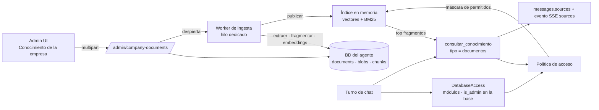

# PRD — Conocimiento de la empresa (documentos propios)

> Estado: **Fases 1, 2 y 3 implementadas**; spike hecho con set sintético, pendiente repetirlo con documentos reales.
> Ver "Estado de implementación" al final.
> Fecha: 2026-09-14.
> Specs por fase:
> [Fase 1 — Ingesta y procesamiento](01-fase-ingesta-y-procesamiento.md) ·
> [Fase 2 — Búsqueda y uso en el chat](02-fase-busqueda-y-chat.md) ·
> [Fase 3 — Interfaz y verificación](03-fase-interfaz-y-verificacion.md)

Un administrador sube desde la interfaz los documentos propios de su
empresa (PDF, TXT y Markdown): procedimientos, políticas, manuales
internos, actas. SAVI los usa para responder, **cita la fuente** y
**respeta los permisos del ERP**: cada documento es visible para toda la
empresa, para quienes tengan ciertos módulos o solo para
administradores, y se limita a las bases o sucursales que el
administrador elija.

---

## Resumen de la decisión

| Tema | Decisión |
|---|---|
| Dos tipos de conocimiento | **Técnico:** el catálogo del ERP, producido por SEO y versionado con SAVI (ya existe). **De la empresa:** documentos subidos por cada cliente, guardados en su instalación (este PRD). |
| Formatos v1 | PDF con capa de texto, TXT y Markdown. |
| Permisos | Visibilidad `all` / `modules` / `admins`, reutilizando los módulos del ERP. Alcance por base. **El filtro se aplica antes de buscar.** |
| Búsqueda | **Híbrida en el proceso:** embeddings locales + BM25, combinados con RRF. Sin `pgvector`. |
| Embeddings | Locales con `fastembed` (ONNX), con un modelo multilingüe incluido en el instalador. El documento no sale del equipo para indexarse. |
| Almacenamiento | BD del agente (Postgres o SQLite): metadatos, archivo original, fragmentos y vectores. |
| Uso en el chat | Nuevo `tipo = "documentos"` en el dispatcher `consultar_conocimiento`. **No se agrega una tool** (límite de 4). |
| Citas | Obligatorias. El usuario ve "Fuentes" con documento y página y abre el original, si tiene permiso. |
| Procesamiento | Asíncrono en segundo plano, sin frenar el chat. Estados visibles. |

---

## 1. Problema

- SAVI conoce **cómo funciona el ERP** (catálogo técnico, cargado en
  `ae7f845`) y **los datos** de la empresa (tools sobre el ERP), pero no
  **cómo trabaja esa empresa**: su proceso de devoluciones, su política de
  crédito, lo que se decidió en el comité.
- Esa información vive en PDFs y documentos sueltos. Un gerente o un
  administrativo pregunta "¿cuál es el tope de descuento sin autorización?"
  y hoy SAVI no tiene de dónde responder.
- Sin permisos, subir actas o documentos sensibles sería una fuga
  interna: la respuesta le llegaría a cualquier usuario.

## 2. Objetivos

1. El administrador sube, clasifica, reemplaza y elimina documentos desde
   la interfaz, sin tocar archivos del servidor.
2. SAVI responde con información de esos documentos y **cita** documento y
   página.
3. Ningún usuario recibe, en una respuesta o en una descarga, contenido de
   un documento que no tiene permiso de ver.
4. Funciona en modo Servidor y en Escritorio, con Postgres o SQLite, sin
   extensiones de base de datos.

## 3. No objetivos (v1)

- **OCR** de PDFs escaneados. Se detectan y se informan como "sin texto".
- DOCX, XLSX, imágenes, correos.
- Grupos o roles propios de SAVI (se reutilizan los módulos del ERP).
- Edición del contenido desde SAVI. Se reemplaza el archivo.
- Carga por usuarios no administradores.
- Sincronizar contenido de documentos a SAVI Cloud. Solo irán conteos,
  cuando se implemente la Fase 2 de [plataforma](../../../docs/plataforma/00-prd.md).
- Búsqueda cruzada entre bases en un mismo turno.
- Más de ~50.000 fragmentos por instalación (ver RNF-04).

## 4. Usuarios

| Usuario | Qué necesita |
|---|---|
| Administrador de SAVI (`is_admin` del ERP o `SAVI_ADMIN_LOGINS`) | Subir y clasificar documentos, ver su estado, verificar quién ve qué. |
| Usuario de la empresa | Respuestas basadas en los documentos que le corresponden, con la fuente a mano. |
| Agente de soporte de SEO (Escritorio, multi-cliente) | Que los documentos de un cliente **nunca** respondan en conversaciones de otro. |

## 5. Modelo de permisos

Cada documento tiene **visibilidad** y **alcance**:

| Visibilidad | Quién lo ve, en una base donde el documento aplica |
|---|---|
| `all` (toda la empresa) | Cualquier usuario con acceso a esa base (D3). |
| `modules` (uno o varios) | Quien tenga **al menos uno** de esos módulos en esa base, o sea administrador en ella. |
| `admins` | Administrador del ERP **en esa base**, o login en `SAVI_ADMIN_LOGINS`. |

| Alcance | Significado |
|---|---|
| Todas las bases | Aplica en cualquier base registrada, incluidas las que se agreguen después. |
| Bases específicas | Solo en las bases elegidas. |

La evaluación usa el `DatabaseAccess` que ya calcula
`ResolveModulesForDatabaseUseCase` para la base de la conversación
(módulos del usuario **en esa base** y su `is_admin` en ella). No se
calculan permisos nuevos.

**Reglas no negociables:**
1. El filtro se aplica **antes** de rankear. Un fragmento sin permiso
   nunca entra al resultado de la tool, así que el modelo nunca lo ve.
2. La descarga del original aplica **la misma** política, evaluada contra
   la base de la conversación donde apareció la cita.
3. Un documento eliminado desaparece del índice **en el acto**.

Límite declarado: un administrador del ERP ve todos los documentos de las
bases donde es administrador.

## 6. Requerimientos funcionales

| ID | Requerimiento | Fase |
|---|---|---|
| RF-01 | El administrador sube uno o varios archivos PDF, TXT o MD de hasta 20 MB. | 1, 3 |
| RF-02 | Al subir, elige título, visibilidad, módulos (si aplica) y alcance por base. | 1, 3 |
| RF-03 | SAVI extrae el texto, lo fragmenta y lo indexa en segundo plano, informando el estado: pendiente, procesando, listo, sin texto o fallido. | 1, 3 |
| RF-04 | Un archivo idéntico a uno existente se rechaza indicando cuál es. | 1 |
| RF-05 | El administrador edita título, visibilidad y alcance sin reprocesar. El cambio aplica en la siguiente pregunta. | 1, 2 |
| RF-06 | El administrador reemplaza el archivo de un documento, conservando su identidad, y lo reprocesa. | 1, 3 |
| RF-07 | El administrador elimina un documento. Su contenido se borra y deja de estar disponible en el acto. | 1, 2 |
| RF-08 | El administrador prueba una búsqueda en una base y, opcionalmente, **como si fuera otro usuario**, para verificar permisos. | 2, 3 |
| RF-09 | SAVI usa los documentos permitidos para responder y cita documento y página. | 2 |
| RF-10 | La respuesta muestra "Fuentes" y el usuario abre el original si tiene permiso. | 2, 3 |
| RF-11 | Los mensajes históricos conservan sus fuentes; si el documento ya no está disponible, lo indican. | 2, 3 |
| RF-12 | El administrador ve el uso: documentos, fragmentos, espacio y límites. | 1, 3 |

## 7. Requerimientos no funcionales

| ID | Requerimiento |
|---|---|
| RNF-01 | **Aislamiento:** tests que prueban que ningún camino (tool, prueba de búsqueda, descarga, fuentes históricas) expone un documento fuera de su visibilidad o alcance. |
| RNF-02 | **El chat no se degrada:** con un PDF de 200 páginas procesándose, la latencia hasta el primer token de un turno concurrente sube menos del 20%. |
| RNF-03 | **Procesamiento:** un PDF de 50 páginas queda listo en menos de 60 s en un equipo de 4 núcleos. |
| RNF-04 | **Búsqueda:** p95 menor a 150 ms con 50.000 fragmentos; memoria del índice menor a 150 MB con ese volumen. |
| RNF-05 | **Portabilidad:** mismo comportamiento en Postgres 10+ y SQLite, sin extensiones. |
| RNF-06 | **Sin internet para indexar:** el modelo de embeddings viaja con el instalador y se carga en modo offline. |
| RNF-07 | **Privacidad:** el contenido de los documentos nunca se loguea. Los logs registran ids, tamaños y tiempos. |
| RNF-08 | **Calidad de recuperación:** en el set de evaluación (§11, P1), el fragmento correcto aparece entre los 6 primeros en al menos el 85% de las preguntas. |
| RNF-09 | **Calidad de código:** Ruff, Pyright strict, pytest, Biome, `vue-tsc`, Vitest y Playwright en verde. |

---

## 8. Arquitectura

### 8.1 Por qué un índice en memoria y no `pgvector`

Verificado el 2026-09-14:

- El Postgres 16 de desarrollo **no** tiene `pgvector` disponible
  (`pg_available_extensions` solo trae `pg_trgm` y `unaccent`).
- En Windows, `pgvector` requiere compilación o binarios de terceros por
  cada servidor.
- El ERP de los clientes corre sobre **PostgreSQL 10** (base de
  conocimiento del ERP, kb 2.0.0). Si el servidor de SAVI comparte ese
  Postgres, `pgvector` no aplica.
- El modo Escritorio usa SQLite.

El volumen de una empresa (cientos de documentos, decenas de miles de
fragmentos) entra con holgura en una matriz `float32` en memoria, con
búsqueda exacta en milisegundos. El índice queda detrás de un puerto
(`DocumentIndex`): si un cliente llega a cientos de miles de fragmentos,
se agrega un adaptador `pgvector` sin tocar los casos de uso.

Supuesto que se hereda de la Fase 1 de plataforma: **un solo proceso**
por instalación (uvicorn con un worker).

## 9. Riesgos

| # | Riesgo | Impacto | Mitigación |
|---|---|---|---|
| R1 | Fuga de documentos entre permisos o entre clientes | Crítico | Filtro previo en el índice, política única y testeada (RNF-01), descarga con la misma política. |
| R2 | Instrucciones maliciosas dentro de un documento ("ignorá tus reglas") | Alto | Contenido entregado como dato delimitado; regla explícita en el system prompt; test con documento adversario. |
| R3 | Calidad de recuperación insuficiente en español | Alto | Spike con set de evaluación real antes de fijar el modelo (Fase 1 §2); búsqueda híbrida para términos exactos. |
| R4 | Tamaño del instalador por el modelo | Medio | El spike mide candidatos; se prefiere el más liviano que cumpla RNF-08. |
| R5 | El procesamiento consume CPU y frena el chat | Alto | Un hilo dedicado, hilos de ONNX acotados y prueba de RNF-02. |
| R6 | PDFs escaneados sin texto | Medio | Estado `no_text` con explicación. OCR queda para una versión posterior. |
| R7 | Los fragmentos relevantes viajan al proveedor de IA al responder | Legal | Igual que los datos del ERP hoy. Aviso en la pantalla de carga. En modo gestionado (plataforma Fase 5) aplica el mismo contrato. |
| R8 | El modelo cita páginas o documentos que no recibió | Medio | Citas por referencia corta (`[D1]`) validadas contra lo que devolvió la tool; referencias inválidas se descartan. |
| R9 | Memoria del índice en instalaciones grandes | Medio | Límite configurable de fragmentos, uso visible y rechazo de cargas que lo excedan. |

## 10. Preguntas abiertas

| # | Pregunta | Recomendación | Bloquea |
|---|---|---|---|
| P1 | ¿Qué documentos reales usamos para el set de evaluación? | 5 a 10 documentos de una empresa piloto (procedimientos, políticas y un acta), con 30 preguntas y su respuesta esperada. | Cierre del spike (Fase 1) |
| P2 | ¿Solo los administradores suben documentos? | Sí en v1. Un rol "editor por módulo" se evalúa con uso real. | No |
| P3 | ¿Límites por defecto? | 20 MB por archivo, 500 páginas, 50.000 fragmentos por instalación. Configurables en `.env`. | Fase 1 |
| P4 | ¿Qué queda al eliminar un documento? | Se borran archivo, fragmentos y vectores. Queda la fila con título y fecha de baja, para que las fuentes históricas digan "documento eliminado". | Fase 1 |
| P5 | ¿DOCX en la siguiente versión? | Probable. Queda fuera de v1 para no ampliar el alcance. | No |

## 11. Métricas de éxito

- El set de evaluación cumple RNF-08.
- Una pregunta cuya respuesta solo está en un documento permitido se
  responde con la cita correcta (E2E).
- La misma pregunta, hecha por un usuario sin permiso, **no** revela el
  contenido (test de backend y prueba de búsqueda simulando usuario).
- Subir un PDF de 50 páginas no altera los tiempos del chat concurrente
  (RNF-02).

---

## 12. Plan por fases

| Fase | Spec | Resultado | Cambio visible |
|---|---|---|---|
| 1 | [Ingesta y procesamiento](01-fase-ingesta-y-procesamiento.md) | Spike de modelo, tablas, API de administración, extracción, fragmentación, embeddings, worker y empaquetado del modelo. | Documentos administrables por API y procesados |
| 2 | [Búsqueda y uso en el chat](02-fase-busqueda-y-chat.md) | Política de acceso, índice híbrido, `tipo = documentos`, citas, fuentes persistidas, descarga y prueba de búsqueda. | SAVI responde con documentos por API |
| 3 | [Interfaz y verificación](03-fase-interfaz-y-verificacion.md) | Pantalla de administración, fuentes en el chat, E2E y verificación de rendimiento. | Todo desde la UI |

Orden obligatorio: 1 → 2 → 3.

## 13. Glosario

| Término | Significado |
|---|---|
| **Documento** | Archivo subido con sus metadatos, permisos y estado. |
| **Fragmento (chunk)** | Porción de texto de un documento, con su rango de páginas y su vector. |
| **Embedding** | Vector numérico que representa el significado de un texto. |
| **BM25** | Ranking léxico por coincidencia de términos; resuelve códigos, números y nombres propios. |
| **RRF** | *Reciprocal Rank Fusion*: combina dos rankings sumando `1 / (k + posición)`. |
| **Visibilidad / alcance** | Quién ve el documento / en qué bases aplica. |
| **Referencia de cita** | Identificador corto (`D1`, `D2`) que la tool asigna por turno y el modelo usa para citar. |

---

## Estado de implementación (2026-09-14)

### Hecho y verificado

| Área | Verificación |
|---|---|
| Ingesta (PDF, TXT, MD), fragmentación, embeddings locales, worker | Tests + subida real: documento `ready` en 2,4 s (incluye la primera carga del modelo). |
| Índice híbrido con filtro de permisos previo | Tests con fragmentos restringidos más parecidos que el permitido. |
| Permisos por visibilidad, módulos y base | Tabla exhaustiva + prueba real con un usuario no admin del ERP (`all`, `admins`, módulo que tiene, módulo que no tiene), en caliente. |
| `tipo = documentos`, citas, `sources` antes de `done`, persistencia | Tests + turno real con Claude: respuesta citada `[D1]`. |
| Descarga protegida | Tests de cada rechazo + real: `200 text/plain nosniff`; `404` desde una conversación que no cita el documento. |
| Instrucciones en documentos | Real con Claude: las ignoró. |
| Pregunta sin respuesta en documentos | Real con Claude: "No encontré información…". |
| Suite | 432 tests; Ruff y Pyright strict en verde. |

### Cambios respecto de la spec

- **Carrera del worker corregida.** Un `save` completo al terminar resucitaba
  documentos eliminados durante el procesamiento. El cierre ahora es
  condicional (`complete_processing`: sin eliminar, `processing`, misma
  `version`) y la edición de permisos usa `update_access_metadata`, que no
  toca el estado.
- **Umbral de similitud 0,80, no 0,3.** e5 comprime los cosenos: con 0,3 no
  se filtraba nada. Se probó 0,82 y el spike lo bajó a 0,80 (ver abajo).
- **`unavailable_reason = "processing"`** además de `deleted` y `no_access`,
  para un documento citado que se está reprocesando.
- **Arranque tolerante.** Si el módulo no puede arrancar (p. ej. tablas sin
  migrar), SAVI sigue funcionando sin documentos en lugar de caerse.
- **Modelo en el instalador: 465 MB** (ONNX fp32); la carpeta de la app queda en 643 MB.
  Verificado con el `.exe` empaquetado: `--check-config` carga el modelo desde el bundle,
  sin red, en 1,6 s. El `savi.spec` excluía `numpy` y `PIL` desde antes: con el módulo
  nuevo eso impedía que el `.exe` arrancara, y se corrigió.

### Fase 3 (interfaz), 2026-09-15

| Área | Verificación |
|---|---|
| `/admin/conocimiento`: subir (varios archivos), editar permisos, reemplazar, reprocesar, eliminar, uso | Vitest + E2E Playwright contra backend real. |
| Prueba de búsqueda "como otro usuario" | E2E con `FSCOGL17`: el documento `admins` aparece como excluido. |
| Fuentes en el chat: marcas de cita, lista "Fuentes", abrir el original | E2E con Claude: respuesta con 7,5, sin `[D…]` crudos, descarga `200 application/pdf nosniff`. |
| Suite E2E completa en Chromium | 7 passed. Firefox y WebKit no se corrieron. |

Cambios respecto de la spec de Fase 3:

- **Marcas de cita con dígitos superíndice Unicode** (`¹`) en lugar de ``:
  el markdown sigue con `html: false` y DOMPurify sin cambios.
- **Prueba de búsqueda en un diálogo**, no en un panel lateral, reutilizando
  el `Dialog` existente.
- **Subida sin barra de progreso por bytes**: estado por archivo (en cola,
  subiendo, subido, duplicado, rechazado). `fetch` no expone progreso y el
  límite de 20 MB no lo justificaba.
- **Bug encontrado en la verificación visual**: insertar la marca pegada a un
  `**` de cierre rompía el negrita (`**7,5 %**¹` se veía con asteriscos). Se
  conserva el espacio después de delimitadores de formato; hay test.

Hallazgo sobre el umbral de similitud (medido en la interfaz): con 0,80 un
documento sin relación pasaba en el borde, por eso se subió a 0,82. Aun así,
"receta de arepas" trae un acta corta con 0,8248. Lo resolvió el spike (abajo).

### Spike del modelo, 2026-09-15

Detalle en [`spike-modelo.md`](spike-modelo.md). Con un set sintético de 8
documentos (MD, TXT, PDF) y 30 preguntas, comparando 4 modelos y 2 tamaños de
fragmento por el pipeline real:

- **RNF-08 cumplido:** recall@6 100% en híbrido con todos los modelos.
- **Se queda `multilingual-e5-small` con fragmento 900.** jina-v2-base-es es
  mejor (recall@1 96% vs 88%) pero 3,5 veces más lento; queda como mejora.
- **Umbral de 0,82 a 0,80:** con 0,82 se perdía una paráfrasis real (q13).
- **Ningún umbral separa las preguntas sin respuesta** con ninguno de los
  modelos. El umbral solo recorta ruido; el "no encontré información" lo
  decide el modelo de lenguaje. No se implementa doble umbral.

### Validación de importación e interfaz, 2026-09-15

- [`validacion-importacion.md`](validacion-importacion.md):
  - **RNF-03 cumplido**: PDF denso de 50 páginas en 11–12 s. En general ~0,2 s por página, casi todo en embeddings.
  - **RNF-02 medido**: mientras se procesa un PDF de 200 páginas, la búsqueda pasa de 25 a 59 ms de mediana.
  - **Truncamiento a 512 tokens**: el modelo no ve ~42% de cada fragmento. En híbrido no se pierden respuestas, así que se queda el fragmento de 900.
  - **Int8**: la versión cuantizada del modelo pesa 129 MB (en lugar de 465) con la misma calidad. Queda como decisión pendiente.
- [`revision-interfaz.md`](revision-interfaz.md): la pantalla es correcta, pero le faltan tres cosas:
  - mostrar el avance de los documentos largos;
  - que las acciones se vean en móvil;
  - buscar y filtrar documentos.

  Hay 12 hallazgos priorizados.

### Pendiente

- **Repetir el spike con documentos reales** (P1): el set sintético tiene
  documentos cortos y no distingue bien entre tamaños de fragmento.
- **Decidir el modelo int8** antes de tener clientes con documentos cargados.
- **Decidir la opción de embeddings en la nube** ([`spike-nube.md`](spike-nube.md)):
  - Gemini pone el fragmento correcto primero en el 100% de los casos (e5-small: 86–88%).
  - A cambio necesita internet en cada pregunta (+~320 ms) y envía los documentos completos al proveedor.
  - Con una key gratuita, la cuota frena la importación.
- **Mejoras de interfaz** priorizadas en `revision-interfaz.md`.
- E2E en Firefox y WebKit.
- RNF-02 (impacto en el chat con un PDF grande procesándose) y RNF-04
  (50.000 fragmentos) sin medir.
- Instalador de punta a punta (Inno Setup) en una VM limpia: se verificó el bundle de
  PyInstaller, no el `.exe` del instalador.

