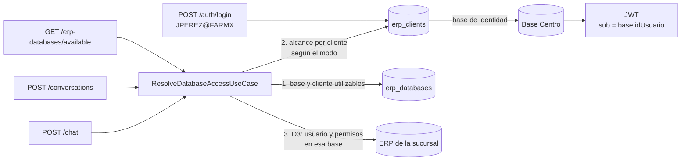

# PRD — Clientes con varias bases de datos (sucursales)

> Estado: **propuesta**, pendiente de aprobación antes de implementar.
> Fecha: 2026-09-14.
> Specs por fase: [Fase 1](01-fase-modelo-y-migracion.md) ·
> [Fase 2](02-fase-acceso-y-login.md) ·
> [Fase 3](03-fase-api-admin.md) · [Fase 4](04-fase-frontend.md)

SAVI deja de tratar cada base del ERP como un cliente aislado. Un
**cliente** (una empresa) agrupa **varias bases**, una por sucursal. Sus
usuarios entran con un solo código (`JPEREZ@FARMACIASX`) y eligen en el
chat la sucursal a consultar. El agente de soporte de SEO que atiende a
varios clientes desde una sola instalación sigue funcionando como hoy.

Es el **paso 1** del camino hacia SAVI multitenant (ver §1). No requiere
el SaaS central, pero deja listo el modelo que ese SaaS va a administrar.

---

## Resumen de la decisión

| Tema | Decisión |
|---|---|
| Modelo | Entidad nueva **Cliente** (`erp_clients`) con N bases. Cada base pertenece a exactamente un cliente. |
| Login | `USUARIO@CODIGO_CLIENTE`. Autentica contra la **base de identidad** del cliente. Sin `@`, se usa el cliente predeterminado. |
| Compatibilidad | La migración crea un cliente por cada base existente, con el mismo código. Los logins actuales siguen funcionando sin cambios. |
| Alcance de acceso | Configurable por instalación. En modo `client`, el usuario solo accede a bases de su cliente. En modo `cross_client`, se mantiene el comportamiento actual de soporte (D10). |
| Permisos | Sin cambio: D3 se sigue aplicando en cada base consultada. El alcance por cliente es un filtro **adicional**, previo a D3. |
| Administración | El `is_admin` del ERP solo da rol de administrador de SAVI si el usuario pertenece al cliente predeterminado. `SAVI_ADMIN_LOGINS` sigue funcionando como vía alternativa. |
| Conversaciones | Siguen atadas a una base, de forma inmutable (D2). No cambia el modelo. |
| Export/import | Formato v2, que agrupa las bases por cliente. Se siguen aceptando archivos v1. |

---

## 1. Contexto: hacia dónde va esto

El objetivo de fondo es un SAVI administrado centralmente por SEO Group.
Se acordó avanzar por pasos, cada uno entregable por separado:

| # | Paso | ¿Necesita el SaaS? |
|---|---|---|
| **1** | **Cliente con varias bases (este PRD)** | No |
| 2 | SaaS: alta de clientes y vinculación de nodos (token de un solo uso, versión, estado, revocación) | Sí |
| 3 | Gestión desde el portal: bases (credenciales cifradas para el nodo), IA con clave propia, usuarios activos, consumo | Sí |
| 4 | IA gestionada por SEO: gateway con medición y facturación | Sí |
| 5 | Acceso desde internet (túnel saliente del nodo) | Solo si hay demanda |

Hay dos ejes independientes, que no forman "tres casos":

| Eje | Opciones |
|---|---|
| Despliegue | **Independiente** (como hoy) o **conectado** al SaaS |
| Licencia de IA | **Clave propia** del cliente o **gestionada por SEO** |

El paso 1 va primero porque el SaaS termina administrando "clientes con
bases". Si ese modelo no existe en SAVI, el portal no tiene qué
administrar.

## 2. Problema

1. **Cliente y base son lo mismo.** El `code` del login vive en
   `erp_databases` (`erp_database.py:28`). Una empresa con tres
   sucursales se registra como tres clientes sin relación entre sí. Sus
   usuarios tienen que saber con qué código entrar y ven las sucursales
   como empresas distintas.
2. **El acceso entre clientes depende solo del login.** Por D3, un
   usuario accede a cualquier base registrada donde exista su `codigo`
   (`list_available_databases.py:32`). Es intencional para el agente de
   soporte (D10). Pero cuando varios clientes comparten instalación, un
   código genérico como `ADMIN` o `SOPORTE` le abre la base de otro
   cliente **sin validar la contraseña en esa base**.
3. **El rol de administrador no distingue clientes.** `is_savi_admin`
   acepta el `is_admin` de la base de identidad, sea cual sea
   (`auth/infrastructure/http/admin.py:28`). El administrador del ERP de
   cualquier cliente registrado administra la instalación completa:
   todas las bases, los proveedores de IA y el consumo de todos.
4. **El export/import es plano.** Replica bases sueltas y no sabe que
   varias pertenecen a la misma empresa.

## 3. Objetivos

1. Agrupar varias bases bajo un cliente y autenticar a sus usuarios con
   un único código.
2. Aislar a los usuarios de un cliente de las bases de otros clientes,
   sin romper el modo soporte.
3. Evitar que un administrador del ERP de un cliente administre la
   instalación entera.
4. Migrar las instalaciones existentes sin intervención manual y sin
   cambiar ningún login.

## 4. No objetivos

- El SaaS central, los nodos, el enrollment y la sincronización (pasos 2
  y 3).
- Los modos de licencia de IA (paso 4) y el acceso por internet (paso 5).
- Rol de **administrador por cliente** con alcance acotado a su cliente.
  Llega con el portal del paso 3.
- Alojar en **una sola instalación** varios clientes sin relación entre
  sí, cada uno con sus propios administradores. Ver R3.
- Consultas que cruzan dos sucursales en un mismo turno.
- Cambiar la base de una conversación existente (D2 se mantiene).
- Heredar permisos desde la base de identidad hacia las sucursales. Ver
  P2.

## 5. Usuarios

| Usuario | Qué necesita |
|---|---|
| Administrador de la instalación | Crear clientes, agregar sucursales, elegir la base de identidad y definir el modo de acceso. |
| Usuario de un cliente | Entrar con `usuario@cliente` y elegir la sucursal. No ver bases de otras empresas. |
| Agente de soporte de SEO | Seguir atendiendo varios clientes desde la misma instalación y ver con claridad de qué cliente y sucursal es cada conversación. |

## 6. Conceptos

| Término | Significado |
|---|---|
| **Cliente** | Empresa que usa el ERP. Tiene un código (el que va después del `@`) y un nombre. |
| **Base / sucursal** | Conexión a una base del ERP. Pertenece a un solo cliente. |
| **Base de identidad** | La base del cliente contra la que se valida usuario y contraseña. Hay exactamente una por cliente activo con bases. |
| **Cliente predeterminado** | El que se usa cuando el login no tiene `@`. Hay exactamente uno. |
| **Modo de acceso** | `client`: solo las bases del propio cliente. `cross_client`: cualquier base donde exista el usuario (soporte). |

---

## 7. Requerimientos funcionales

| ID | Requerimiento | Fase |
|---|---|---|
| RF-01 | Existe la entidad Cliente, con código único, nombre único, estado activo o inactivo, baja lógica y marca de predeterminado. | 1 |
| RF-02 | Cada base pertenece a un cliente, y cada cliente con bases tiene exactamente una base de identidad. | 1 |
| RF-03 | Una instalación existente, después de migrar, conserva todos sus logins, conversaciones y su base predeterminada, sin configurar nada. | 1 |
| RF-04 | El login `USUARIO@CODIGO` autentica contra la base de identidad del cliente con ese código. Sin `@`, contra la del cliente predeterminado. | 2 |
| RF-05 | En modo `client`, el selector, la creación de conversaciones y el chat solo permiten bases del cliente del usuario. En modo `cross_client`, se comporta como hoy. | 2 |
| RF-06 | El selector del chat devuelve cliente y sucursal por cada base disponible. | 2 |
| RF-07 | El `is_admin` del ERP solo otorga rol de administrador de SAVI si el usuario pertenece al cliente predeterminado. `SAVI_ADMIN_LOGINS` sigue funcionando. | 2 |
| RF-08 | El administrador crea, edita, activa, desactiva, elimina y marca como predeterminado un cliente. | 3 |
| RF-09 | El administrador agrega una base a un cliente, la mueve a otro cliente y la designa como base de identidad. | 3 |
| RF-10 | Cambiar la base de identidad, o mover una base de identidad, exige confirmación explícita cuando hay conversaciones que dependen de ella. | 3 |
| RF-11 | El export/import agrupa por cliente (formato v2) y acepta archivos v1. | 3 |
| RF-12 | El consumo de administración se puede filtrar por cliente. | 3 |
| RF-13 | La administración muestra los clientes con sus bases. Indica cuál es la base de identidad y cuál el cliente predeterminado, y cómo se escribe el login de cada cliente. | 4 |
| RF-14 | El selector del chat agrupa las bases por cliente cuando hay más de uno, y la barra lateral muestra "Cliente · Sucursal". | 4 |

## 8. Requerimientos no funcionales

| ID | Requerimiento |
|---|---|
| RNF-01 | **Sin enumeración:** un cliente inexistente, inactivo, eliminado o sin base de identidad utilizable responde igual que una contraseña incorrecta, con el mismo piso de duración (`_MIN_FAILED_LOGIN_SECONDS`). |
| RNF-02 | **Aislamiento verificable:** hay tests que prueban que en modo `client` un usuario no puede listar, abrir ni chatear contra una base de otro cliente, aunque su `codigo` exista en ella. |
| RNF-03 | **Migración segura:** funciona en SQLite nueva (`create_all` + `stamp`), en SQLite existente y en Postgres (`upgrade`). Tiene `downgrade` real. Los índices únicos parciales se verifican en los dos caminos. |
| RNF-04 | **Sin regresión:** la suite actual sigue en verde. Con la configuración por defecto de una instalación existente (`cross_client`), ningún comportamiento observable cambia, salvo la corrección de RF-07. |
| RNF-05 | **Latencia:** resolver el cliente del usuario no agrega más de una consulta por request a la BD del agente. Si se cachea, la caché se invalida al guardar desde administración. |
| RNF-06 | **Calidad:** Ruff + Pyright strict + pytest. En el frontend, Biome + `vue-tsc` + Vitest. E2E Playwright del flujo de administración y del selector. |
| RNF-07 | **Seguridad de credenciales:** sin cambios respecto de D4. Ningún response incluye contraseñas, ni en claro ni cifradas. |

---

## 9. Decisiones de diseño

Numeradas con `C` para no chocar con D1–D10 de
[`multi_erp_databases_spec.md`](../multi_erp_databases_spec.md), que
siguen vigentes.

| # | Decisión | Detalle |
|---|---|---|
| C1 | Cliente como entidad propia dentro del módulo `erp_databases` | [Fase 1 §2](01-fase-modelo-y-migracion.md) |
| C2 | El código de login pasa al cliente. Las bases conservan un código propio, único dentro del cliente. | [Fase 1 §2](01-fase-modelo-y-migracion.md) |
| C3 | Base de identidad con flag `is_identity` e índice único parcial por cliente | [Fase 1 §2](01-fase-modelo-y-migracion.md) |
| C4 | `is_default` pasa de la base al cliente | [Fase 1 §2](01-fase-modelo-y-migracion.md) |
| C5 | La migración hace el backfill: un cliente por base, con el mismo código | [Fase 1 §4](01-fase-modelo-y-migracion.md) |
| C6 | Modo de acceso por instalación (`SAVI_CLIENT_ACCESS_MODE`). Si falta, `cross_client`. | [Fase 2 §3](02-fase-acceso-y-login.md) |
| C7 | Un único punto de control de acceso: `ResolveDatabaseAccessUseCase` | [Fase 2 §4](02-fase-acceso-y-login.md) |
| C8 | El JWT no cambia. El cliente se deriva de la base de identidad. | [Fase 2 §2](02-fase-acceso-y-login.md) |
| C9 | `is_admin` del ERP solo cuenta para el cliente predeterminado | [Fase 2 §5](02-fase-acceso-y-login.md) |
| C10 | Cambios de identidad con confirmación explícita y conteo de conversaciones afectadas | [Fase 3 §3](03-fase-api-admin.md) |

## 10. Arquitectura

## 11. Riesgos

| # | Riesgo | Impacto | Mitigación |
|---|---|---|---|
| R1 | **Pérdida de historial al cambiar la base de identidad.** La identidad es `(base, idUsuario)`. Si cambia la base, cambian el `idUsuario` y el owner. | Los usuarios dejan de ver sus conversaciones previas. Los datos no se pierden. | C10: el API rechaza con `409` y el número de conversaciones afectadas. La UI pide confirmación explícita. Queda documentado. |
| R2 | **Cambio de login al mover una base de identidad a otro cliente.** Los usuarios que entraban con `@NORTE` ahora tienen que usar `@FARMX`. | Soporte recibe llamadas de "no puedo entrar". | La UI advierte el cambio de código antes de confirmar. P3 evalúa alias de código. |
| R3 | **Varios clientes sin relación en una sola instalación** siguen compartiendo administradores de SAVI. | Un admin ve la configuración de otro cliente. | Fuera de alcance, declarado (§4). C9 reduce el caso más grave. El rol por cliente llega en el paso 3. |
| R4 | **Un código genérico (`ADMIN`) en modo `cross_client`** abre bases de otros clientes. | Acceso entre clientes. | Es el comportamiento actual, ahora explícito y configurable. Las instalaciones nuevas nacen en `client`. |
| R5 | **Migración con bases eliminadas** cuyo código coincide con el de una activa. | Falla de índice único. | Los clientes creados para bases eliminadas nacen eliminados, y el índice único es parcial (`deleted_at IS NULL`). Hay test específico. |
| R6 | **`downgrade` con códigos de base repetidos** entre clientes. | Violaría el índice global que restaura. | El `downgrade` falla con un mensaje claro antes de tocar datos. |
| R7 | **Usuarios que no existen en todas las sucursales.** | Un usuario solo ve las sucursales donde está dado de alta. | Es D3, y es correcto. Se documenta en la UI de administración. P2 decide si hace falta herencia. |

## 12. Preguntas abiertas

| # | Pregunta | Recomendación | Bloquea |
|---|---|---|---|
| P1 | ¿El modo de acceso va en `.env` o se edita desde la UI? | `.env` (`SAVI_CLIENT_ACCESS_MODE`), igual que `SAVI_ADMIN_LOGINS`. Se toca una vez por instalación y en el paso 3 lo va a gestionar el portal. El instalador escribe `client`. | Fase 2 |
| P2 | ¿Los usuarios de un cliente existen en todas las bases de sus sucursales, o solo en la de identidad? | Verificarlo con un cliente real. Si solo existen en la de identidad, hace falta un flag por cliente que herede permisos, y eso es una excepción explícita a D3. Por defecto se mantiene D3. | Fase 2 (solo si la respuesta es "solo en identidad") |
| P3 | ¿Se aceptan alias de código después de fusionar clientes? | No en este paso: el mensaje de advertencia alcanza. Se reevalúa si soporte lo pide. | No |
| P4 | ¿En la interfaz se llama "Cliente" o "Empresa"? | "Cliente", que coincide con el login `usuario@cliente` y con el lenguaje del SaaS. | Fase 4 |

## 13. Métricas de éxito

- Una instalación existente actualiza y todos sus usuarios entran con el
  mismo login de antes (test de migración + E2E).
- Un cliente con tres sucursales se configura desde la UI sin tocar el
  `.env`, y sus usuarios eligen la sucursal en el chat.
- En modo `client`, cero caminos de acceso a bases de otro cliente
  (tests de aislamiento por endpoint).
- Cero apariciones de contraseñas en responses (test existente,
  extendido a los endpoints nuevos).

---

## 14. Plan por fases

Cada fase se puede entregar, verificar y commitear por separado.

| Fase | Spec | Resultado | Cambio visible |
|---|---|---|---|
| 1 | [Modelo y migración](01-fase-modelo-y-migracion.md) | Tabla `erp_clients`, `client_id` e `is_identity` en bases, backfill, seed, repositorios y login adaptado. | Ninguno |
| 2 | [Acceso y login](02-fase-acceso-y-login.md) | Login por cliente, modo de acceso, punto único de control, gate de admin, selector con cliente. | Aislamiento en modo `client` |
| 3 | [API de administración](03-fase-api-admin.md) | CRUD de clientes, mover bases, cambio de identidad, export/import v2, filtro de consumo. | Clientes configurables por API |
| 4 | [Frontend](04-fase-frontend.md) | Pantalla de clientes y bases, selector agrupado, etiquetas, filtro de consumo, E2E. | Todo desde la UI |

Orden obligatorio: 1 → 2 → 3 → 4. La Fase 2 va antes que el API de
administración por la misma razón que en multi-BD: agrupar bases sin el
alcance por cliente ya en su lugar expondría el hueco de §2.2 justo
cuando más clientes conviven.
