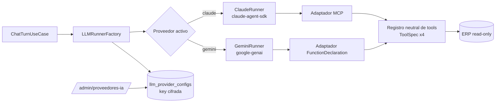

# PRD — Proveedores de IA configurables (Claude + Gemini)

> Estado: **propuesta** — pendiente de aprobación antes de implementar.
> Fecha: 2026-09-13.
> Specs por fase: [Fase 1](01-fase-tools-neutrales.md) ·
> [Fase 2](02-fase-configuracion-proveedores.md) ·
> [Fase 3](03-fase-gemini.md) · [Fase 4](04-fase-interfaz-admin-y-e2e.md)

SAVI deja de estar atado a Claude: un administrador elige desde la
interfaz qué proveedor de IA usa la instalación (Claude o Gemini, para
empezar), con qué modelo y con qué API key. Todo lo que el chat hace hoy
—tools del ERP, permisos por base, multi-cliente, auto-título, consumo—
funciona igual con cualquiera de los dos. La arquitectura deja lugar para
sumar otros proveedores sin tocar el caso de uso del chat.

---

## Resumen de la decisión

| Tema | Decisión |
|---|---|
| Dónde se configura | **Interfaz de administración** (`/admin/proveedores-ia`), guardado en la BD del agente. El `.env` solo siembra la configuración inicial de Claude para no romper instalaciones existentes. |
| Qué se configura | Proveedor activo, modelo de chat, modelo de títulos, API key y precios por modelo. |
| Primer proveedor nuevo | **Gemini** vía SDK oficial `google-genai`, por API key. |
| Cómo se integra Gemini | Loop manual de *function calling* con streaming. No se usa el soporte MCP del SDK de Google: es experimental y ejecuta las tools sin dejarnos emitir eventos ni aplicar límites. |
| Claude | Sigue con `claude-agent-sdk` (decisión vigente en `CLAUDE.md` §10). Solo se desacopla de las tools y de la configuración por `.env`. |
| Tools del ERP | **Una sola definición neutral** compartida por todos los proveedores. Se siguen respetando las 4 tools con dispatcher. |
| API keys | Cifradas en reposo con el mismo esquema Fernet que ya protege las credenciales de las bases del ERP. Nunca salen del backend. |
| Cambio de proveedor | En caliente, sin reiniciar. Aplica desde el siguiente turno; cada mensaje registra con qué proveedor y modelo se generó. |

---

## 1. Problema

- El chat solo funciona con Claude. El proveedor, el modelo y la credencial
  salen del `.env` (`CLAUDE_MODEL`, `CLAUDE_TITLE_MODEL`,
  `ANTHROPIC_API_KEY`, `CLAUDE_CODE_OAUTH_TOKEN`), así que cambiarlos exige
  editar un archivo en `Program Files` y reiniciar SAVI.
- No hay forma de evaluar ni adoptar otro proveedor (costo, disponibilidad,
  preferencia del cliente) sin reescribir el runner.
- Claude depende del CLI (Node.js, Git Bash, login). Un proveedor por API
  pura simplifica la instalación en el equipo del cliente.

## 2. Objetivos

1. Configurar el proveedor de IA **desde una interfaz**, sin tocar el `.env`
   ni reiniciar.
2. Soportar **Gemini** con paridad funcional completa respecto de Claude.
3. Dejar un punto de extensión claro: agregar un tercer proveedor debe
   implicar escribir un adaptador, no modificar el caso de uso del chat.
4. Mantener la trazabilidad de consumo y costo por proveedor y modelo.

## 3. No objetivos (fuera de alcance)

- Enrutar automáticamente entre proveedores (fallback, balanceo o
  selección por tipo de pregunta).
- Elegir proveedor **por conversación** o **por usuario**: es una
  configuración global de la instalación.
- Proveedores distintos de Claude y Gemini (quedan preparados, no
  implementados).
- Migrar Claude del `claude-agent-sdk` a la API directa.
- Volver opcionales los prerrequisitos de Claude en el instalador (Node,
  Git, CLI). **Claude sigue siendo el proveedor por defecto**, así que el
  instalador los mantiene. Quitarlos queda para una iteración posterior,
  cuando Gemini esté validado en producción.
- Vertex AI (Gemini empresarial con credenciales de GCP): solo API key del
  Gemini Developer API.

## 4. Usuarios

| Usuario | Qué necesita |
|---|---|
| Administrador de SAVI | Elegir proveedor, modelo y key; probar la conexión; ver cuánto cuesta. |
| Agente / usuario del ERP | Que el chat funcione igual sin importar el proveedor. No ve ni elige el proveedor. |
| Soporte técnico | Saber con qué proveedor y modelo se generó una respuesta, y diagnosticar credenciales. |

---

## 5. Requerimientos funcionales

| ID | Requerimiento | Fase |
|---|---|---|
| RF-01 | El administrador ve la lista de proveedores soportados con su estado (configurado, activo, credencial válida). | 4 |
| RF-02 | El administrador ingresa o reemplaza la API key de un proveedor. La key nunca se muestra de vuelta. | 2, 4 |
| RF-03 | El administrador prueba la credencial antes de guardarla; la prueba devuelve la lista de modelos disponibles. | 2, 4 |
| RF-04 | El administrador elige el modelo de chat y el modelo de títulos desde los modelos que devolvió la prueba. | 2, 4 |
| RF-05 | El administrador define precios por modelo (USD por millón de tokens de entrada, salida y caché). | 2, 4 |
| RF-06 | El administrador activa un proveedor. Solo uno está activo a la vez. El cambio aplica al siguiente turno sin reiniciar. | 2, 4 |
| RF-07 | El chat con Gemini soporta las tres acciones (`send`, `edit_last`, `regenerate`) y emite los mismos eventos SSE. | 3 |
| RF-08 | Las 4 tools (`info_empresa`, `consultar_datos`, `consultar_libre`, `consultar_conocimiento`) funcionan con Gemini, respetando permisos por base (D3), multi-BD y auditoría de SQL libre. | 1, 3 |
| RF-09 | El auto-título en dos fases funciona con el proveedor activo, usando su modelo de títulos. | 1, 3 |
| RF-10 | Cada mensaje del asistente persiste `provider`, `model`, `usage` y `cost_usd`. | 3 |
| RF-11 | Una instalación existente sigue funcionando con Claude después de actualizar, sin configurar nada (seed desde `.env`). | 2 |
| RF-12 | El diagnóstico ("Diagnosticar SAVI") informa el proveedor activo y valida sus requisitos (CLI solo si es Claude). | 4 |

## 6. Requerimientos no funcionales

| ID | Requerimiento |
|---|---|
| RNF-01 | **Seguridad:** API keys cifradas en reposo (Fernet). Ningún response, log ni reporte de diagnóstico incluye la key, ni en claro ni cifrada. |
| RNF-02 | **Paridad de comportamiento:** el system prompt, el rechazo de temas fuera del ERP y la confidencialidad (no revelar tools, modelo ni infraestructura) aplican igual con cualquier proveedor. |
| RNF-03 | **Sin regresión:** la Fase 1 no cambia ningún comportamiento observable de Claude. La suite actual sigue en verde en todas las fases. |
| RNF-04 | **Extensibilidad:** agregar un proveedor es agregar un adaptador (`LLMRunner` + `TitleGenerator` + descriptor), sin tocar `ChatTurnUseCase`. |
| RNF-05 | **Resiliencia:** una credencial inválida o un proveedor caído produce un error legible en el chat (`ErrorEvent`) que indica dónde corregirlo, nunca un 500. |
| RNF-06 | **Latencia:** resolver la configuración activa no agrega una consulta a BD por turno (cache en memoria con invalidación al guardar). |
| RNF-07 | **Calidad:** Ruff + Pyright strict + tests en verde; frontend con Biome + `vue-tsc`; E2E con Playwright en ambos proveedores (Fase 4). |

---

## 7. Arquitectura propuesta

Puntos clave:

- `ChatTurnUseCase` sigue dependiendo solo del puerto `LLMRunner` y de los
  eventos `ChatEvent`. No se entera del proveedor.
- El historial ya viaja como texto en cada turno
  (`_format_history_block`), así que no hay estado del lado del proveedor
  y el cambio en caliente es seguro.
- Las implementaciones de las tools (`*_impl`) ya son independientes del
  SDK. Lo único que cambia es el envoltorio de cada proveedor.

Detalle de cada pieza en las specs de fase.

---

## 8. Riesgos

| # | Riesgo | Impacto | Mitigación |
|---|---|---|---|
| R1 | **Datos del ERP de clientes viajan a Google** al activar Gemini. | Legal / comercial | Confirmación explícita al activar un proveedor (Fase 4) y aprobación de negocio antes de habilitarlo en clientes (ver P1). |
| R2 | Gemini usa las tools distinto a Claude (prompts y descripciones afinados para Claude). | Calidad de respuestas | JSON Schema explícito por tool (Fase 1) + checklist E2E de las 4 tools (Fase 4). |
| R3 | Perder las *thought signatures* de Gemini entre llamadas degrada el razonamiento multi-paso. | Calidad | Reenviar siempre el `content` completo que devolvió el modelo (Fase 3). |
| R4 | Precios desactualizados o sin cargar. | KPIs de costo incorrectos | Precios editables en la UI; aviso visible si el modelo activo no tiene precio (Fase 4). |
| R5 | La credencial de Claude hoy se inyecta al entorno una sola vez por proceso (`os.environ.setdefault`). | Cambio de key sin efecto hasta reiniciar | Pasar la credencial por turno al SDK (Fase 2, con verificación previa). |
| R6 | Mezclar costos de proveedores en los KPIs de consumo. | Reportes engañosos | `provider` y `model` por mensaje (Fase 3). |
| R7 | Una key cifrada se vuelve ilegible si cambia `ERP_CREDENTIALS_KEY`. | Chat caído | Mismo manejo que las bases del ERP: marcar `credentials_unreadable` y pedir re-ingresar, sin tumbar la app. |

## 9. Preguntas abiertas

| # | Pregunta | Recomendación | Bloquea |
|---|---|---|---|
| P1 | ¿Está aprobado enviar datos del ERP de clientes a Google? | Decisión de negocio; técnicamente se implementa con confirmación al activar. | Habilitar Gemini en clientes (no el desarrollo) |
| P2 | ¿La configuración de proveedores entra en el export/import de configuración entre agentes? | Sí, en una iteración posterior, reutilizando el cifrado por contraseña ya existente. | No |
| P3 | ¿Precios sembrados por defecto o ingresados a mano? | A mano, sin valores inventados en código; sin precio, el costo queda en `null` y la UI avisa. | Fase 2 |
| P4 | ¿Claude se configura en la UI con API key, con token OAuth o con ambos? | Ambos, más la opción "sesión local del equipo", que es el comportamiento actual del CLI. | Fase 2 |

## 10. Métricas de éxito

- Con Gemini activo, el checklist E2E completo pasa (las 3 acciones del
  chat, las 4 tools, multi-BD, estado degradado, auto-título y consumo).
- Cambiar de proveedor desde la UI aplica en el siguiente mensaje, sin
  reiniciar.
- Una instalación actualizada desde una versión previa sigue respondiendo
  con Claude sin intervención.
- Cero apariciones de API keys en responses, logs y reportes de
  diagnóstico (verificado por test).

---

## 11. Plan por fases

Cada fase es entregable, verificable y commiteable por separado.

| Fase | Spec | Resultado | Cambio visible |
|---|---|---|---|
| 1 | [Tools neutrales y puertos](01-fase-tools-neutrales.md) | Tools con definición neutral, puerto `TitleGenerator`, helpers compartidos. Claude reorganizado como un adaptador más. | Ninguno (refactor) |
| 2 | [Configuración de proveedores](02-fase-configuracion-proveedores.md) | Módulo `llm_providers`: tabla, cifrado, seed desde `.env`, API admin y resolución del proveedor por turno. | Claude configurable por API |
| 3 | [Integración de Gemini](03-fase-gemini.md) | `GeminiRunner`, título, cálculo de costo, `provider`/`model` por mensaje. | Gemini funcional por API |
| 4 | [Interfaz admin y verificación E2E](04-fase-interfaz-admin-y-e2e.md) | Pantalla `/admin/proveedores-ia`, diagnóstico y E2E en ambos proveedores. | Todo desde la UI |

Orden obligatorio: 1 → 2 → 3 → 4. La Fase 1 va primero porque cualquier
proveedor nuevo sobre el acoplamiento actual obligaría a duplicar las
tools y a reabrir el caso de uso del chat.

## 12. Glosario

| Término | Significado |
|---|---|
| Proveedor | Empresa y API del modelo de IA (Claude, Gemini). |
| Adaptador | Implementación de los puertos del chat para un proveedor. |
| `ToolSpec` | Definición neutral de una tool: nombre, descripción, JSON Schema y handler. |
| Function calling | Mecanismo de Gemini para que el modelo pida ejecutar una tool. |
| Thought signature | Estado de razonamiento que Gemini adjunta a su respuesta y que hay que reenviar en la siguiente llamada. |
