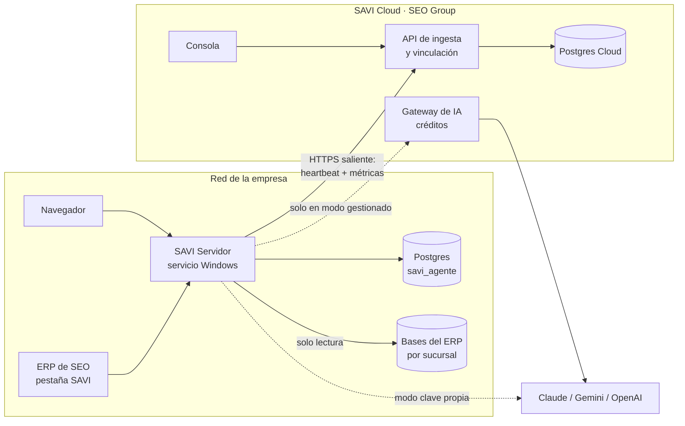
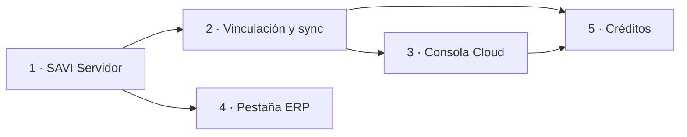

# PRD — Plataforma SAVI: servidor por empresa, SAVI Cloud y licenciamiento

> Estado: **propuesta**, pendiente de aprobación antes de implementar.
> Fecha: 2026-09-14.
> Specs por fase:
> [Fase 1 — SAVI Servidor](01-fase-savi-servidor.md) ·
> [Fase 2 — Vinculación y sincronización](02-fase-vinculacion-y-sincronizacion.md) ·
> [Fase 3 — Consola SAVI Cloud](03-fase-consola-cloud.md) ·
> [Fase 4 — Pestaña SAVI en el ERP](04-fase-pestana-erp.md) ·
> [Fase 5 — IA gestionada por SEO (créditos)](05-fase-creditos-gestionados.md)

Este PRD lleva SAVI a producción en empresas: cada empresa instala **un
SAVI Servidor** en su red, lo administra desde un solo lugar y sus
usuarios (gerentes, administrativos, cajeros) entran desde el navegador o
desde una pestaña dentro del ERP. Cada servidor queda **vinculado a SAVI
Cloud**, el master de SEO Group, y le envía métricas de uso de forma
continua. Así SEO puede analizar cada cliente y, si el cliente lo elige,
venderle la IA como créditos en lugar de que pague su propia licencia.

---

## Resumen de la decisión

| Tema | Decisión |
|---|---|
| Dónde corre SAVI | **En la red de cada empresa** (SAVI Servidor), junto a su ERP. SEO nunca tiene acceso a las bases del ERP. |
| Cuántas instalaciones por empresa | **Una.** Las PCs no instalan nada: entran por navegador o por la pestaña del ERP. |
| Historial de chats | Postgres del servidor. Es obligatorio en modo servidor. |
| Soporte de SEO | Se mantiene el modo **Escritorio** actual, con el selector multi-cliente. |
| SAVI Cloud | Aplicación nueva de SEO: registra clientes y servidores, recibe métricas y administra créditos. |
| Qué se sincroniza | **Métricas, no contenido.** Tokens, costo, modelo, conteos, versión y estado. Nunca preguntas, respuestas, SQL ni datos del ERP. Usuarios con seudónimo. |
| Dirección de la conexión | **Siempre saliente**, del servidor hacia Cloud, por HTTPS. Cloud nunca abre conexiones hacia la empresa. |
| Sin conexión a Cloud | SAVI **sigue funcionando** con clave propia. Las métricas se envían cuando vuelve la conexión, sin pérdida. |
| Licencia de IA | Dos modos por servidor: **clave propia** (ya implementado) o **gestionada por SEO** con créditos, a través de un gateway en Cloud. |
| Integración con el ERP | Pestaña que embebe la interfaz web del SAVI Servidor. Primero con login normal y después con inicio de sesión único. |

---

## 1. Contexto

### 1.1 Qué ya está implementado

| Capacidad | Estado |
|---|---|
| Versionado con tags de git, visible en la interfaz | ✅ |
| Proveedores de IA configurables por API (Claude, Gemini, OpenAI) | ✅ |
| Varias bases del ERP con selector por conversación (soporte multi-cliente) | ✅ |

### 1.2 Problema para salir a producción

1. **Una instalación por PC.** El instalador arma un SAVI completo en
   cada equipo: escucha solo en `127.0.0.1` (`installer/env.template`),
   corre en la sesión del usuario (bandeja del sistema) y guarda los
   chats en `%LOCALAPPDATA%\SAVI\savi.db`. Una empresa con 20 usuarios
   configura 20 veces las bases y el proveedor de IA, y cada usuario
   pierde su historial si cambia de equipo.
2. **Nadie administra la empresa como un todo.** No hay un lugar donde
   el administrador vea quién usa SAVI, cuánto consume o qué bases están
   configuradas.
3. **SEO no ve nada.** Los logs y el consumo son locales a cada equipo
   (`installer/README.md`, sección "El log"). No hay forma de saber qué
   clientes usan SAVI, con qué versión, cuánto les cuesta ni si algo
   falla.
4. **Un solo modelo de licencia.** Cada cliente tiene que contratar y
   configurar su propio proveedor de IA. No hay forma de vender SAVI "con
   la IA incluida".
5. **SAVI vive fuera del ERP.** El usuario tiene que abrir otra
   aplicación en lugar de consultarlo desde donde trabaja.

## 2. Objetivos

1. Una empresa instala SAVI **una vez**, en un servidor de su red, y
   todos sus usuarios lo usan desde el navegador con su historial
   centralizado.
2. Cada SAVI Servidor queda **vinculado y sincronizando** métricas con
   SAVI Cloud, sin exponer datos del ERP ni conversaciones.
3. SEO tiene una **consola** con el estado y las métricas de cada
   cliente y de cada servidor.
4. El usuario del ERP abre SAVI desde una **pestaña dentro del ERP**.
5. SEO puede vender la IA como **créditos**, con límites de uso y estado
   de cuenta mensual, sin que el cliente administre claves.

## 3. No objetivos

- **Alojar SAVI en la nube de SEO** con acceso remoto a las bases de los
  clientes. SEO no tiene ni va a tener acceso a esas bases.
- **Acceso desde internet** a un SAVI Servidor. Solo red interna. Una
  VPN de la empresa queda por su cuenta.
- **Agrupar varias empresas en un mismo SAVI Servidor.** Cada empresa
  tiene el suyo, y el aislamiento lo da el despliegue. El análisis
  descartado queda en [`backend/docs/erp_clients/`](../../backend/docs/erp_clients/00-prd.md)
  como referencia, por si SEO llegara a alojar varias empresas.
- **Sincronizar contenido de conversaciones** hacia Cloud.
- **Configurar remotamente** las bases del ERP desde Cloud. Las
  credenciales del ERP nunca salen del servidor de la empresa.
- **Pasarela de pagos y facturación electrónica.** Cloud produce el
  estado de cuenta, y la factura se emite en el ERP de SEO, como hoy.
- Aplicaciones móviles.

## 4. Modos de despliegue

Una sola base de código y un solo instalador, con tres modos que se
eligen en el asistente:

| Modo | Quién | Qué instala | Datos |
|---|---|---|---|
| **Servidor** | La empresa cliente | Servicio de Windows, escucha en la red y se conecta a Postgres | Postgres de la empresa |
| **Escritorio** | Agente de soporte de SEO | Lo de hoy: bandeja del sistema, `127.0.0.1`, selector multi-cliente | SQLite local o Postgres compartido |
| **Acceso** | PCs de la empresa (opcional) | Solo un acceso directo a la URL del servidor | Ninguno |

Los tres pueden vincularse a Cloud. El modo **Servidor** es el que se
vincula siempre en producción.

## 5. Modos de licencia de IA

| Modo | Cómo funciona | Cloud |
|---|---|---|
| **Clave propia** | El administrador de la empresa carga su clave de Claude, Gemini u OpenAI en su servidor. Es lo que ya existe. | Solo métricas. Si Cloud no responde, SAVI sigue igual. |
| **Gestionada por SEO** | El servidor llama al **gateway de SAVI Cloud**, que pone la clave de SEO, mide y descuenta créditos. | Obligatorio: sin Cloud no hay IA. |

El modo se asigna desde la consola de Cloud a cada servidor y le llega en
el heartbeat (Fase 5).

## 6. Usuarios

| Usuario | Dónde actúa | Qué necesita |
|---|---|---|
| Usuario de la empresa (gerente, administrativo) | Navegador o pestaña del ERP | Preguntar sobre su negocio y elegir sucursal si hay varias. |
| Administrador de la empresa | SAVI Servidor → Administración | Bases, proveedor de IA, sesiones activas, consumo, vinculación con Cloud. |
| Área de sistemas de la empresa | Servidor Windows | Instalar, actualizar, respaldar y diagnosticar. |
| Agente de soporte de SEO | SAVI Escritorio | Atender varios clientes, como hoy. |
| Staff de SEO (comercial, soporte, dirección) | Consola SAVI Cloud | Clientes, servidores, métricas, alertas, tokens de vinculación, créditos. |

---

## 7. Arquitectura

### 7.1 Principios

1. **Los datos del ERP no salen de la empresa.** Cloud recibe métricas.
   El gateway (Fase 5) ve el tráfico con el modelo, pero no lo guarda.
2. **SAVI no depende de Cloud para funcionar** con clave propia. Cloud
   es observabilidad y negocio, no un punto único de falla.
3. **Toda conexión es saliente** desde la empresa. No hay puertos
   abiertos hacia internet ni túneles.
4. **Privacidad por defecto.** Usuarios con seudónimo, sin contenido, y
   una pantalla en el servidor que muestra exactamente qué se envía.
5. **Idempotencia en todo lo que viaja.** Reintentar nunca duplica
   métricas ni cobros.
6. **Una sola base de código de SAVI.** El modo servidor es
   configuración, no un fork.

## 8. Requerimientos funcionales

| ID | Requerimiento | Fase |
|---|---|---|
| RF-01 | El instalador ofrece los modos Servidor, Escritorio y Acceso. | 1 |
| RF-02 | En modo Servidor, SAVI corre como servicio de Windows que arranca con el sistema, sin sesión de usuario. | 1 |
| RF-03 | En modo Servidor, SAVI escucha en la red interna, en un puerto fijo, con HTTPS opcional (certificado propio o autofirmado). | 1 |
| RF-04 | En modo Servidor, el historial vive en Postgres y cualquier usuario ve sus conversaciones desde cualquier equipo. | 1 |
| RF-05 | El administrador ve y revoca las sesiones activas de los usuarios. | 1 |
| RF-06 | El administrador ve el estado del servidor: URL de acceso, servicio, certificado, BD, versión. | 1 |
| RF-07 | Login con límite de intentos por IP y por usuario. | 1 |
| RF-08 | El staff de SEO registra clientes y genera tokens de vinculación de un solo uso. | 2 |
| RF-09 | El administrador de la empresa vincula su servidor con un token, desde el instalador o desde Administración. | 2 |
| RF-10 | El servidor envía un heartbeat periódico con versión, estado y salud. | 2 |
| RF-11 | El servidor envía métricas incrementales de turnos, conversaciones, sesiones, consultas libres e inventario de bases, sin contenido y con seudónimos. | 2 |
| RF-12 | Sin conexión, el servidor sigue funcionando y al reconectar envía todo lo pendiente, sin pérdida ni duplicados. | 2 |
| RF-13 | El administrador de la empresa ve el estado de la vinculación y un ejemplo real de lo que se envía. | 2 |
| RF-14 | SEO puede suspender o revocar un servidor, y rotar su credencial. | 2, 3 |
| RF-15 | Consola con resumen global, clientes, detalle por cliente, servidores, alertas y tokens. | 3 |
| RF-16 | Métricas por cliente: usuarios activos, conversaciones, turnos, tokens, costo, mezcla de proveedores, errores, versión. | 3 |
| RF-17 | Usuarios del staff con roles, doble factor y auditoría de acciones. | 3 |
| RF-18 | El ERP muestra una pestaña SAVI que carga el SAVI Servidor configurado. | 4 |
| RF-19 | El usuario del ERP entra a SAVI sin volver a escribir credenciales (inicio de sesión único). | 4 |
| RF-20 | SAVI recibe del ERP la empresa/sucursal activa y la preselecciona. | 4 |
| RF-21 | SEO asigna a un servidor el modo "IA gestionada" con proveedores y modelos permitidos. | 5 |
| RF-22 | El gateway de Cloud atiende las llamadas de IA del servidor con claves de SEO y mide el consumo por cliente. | 5 |
| RF-23 | Cada cliente tiene saldo de créditos, recargas, límite mensual y alertas al 80% y al 100%. | 5 |
| RF-24 | Sin créditos, el chat informa el motivo de forma legible, antes de abrir el stream. | 5 |
| RF-25 | Estado de cuenta mensual por cliente, exportable. | 5 |

## 9. Requerimientos no funcionales

| ID | Requerimiento |
|---|---|
| RNF-01 | **Seguridad en red:** el modo Servidor no se instala sin `JWT_SECRET` aleatorio, con `APP_DEBUG=false`, sin documentación OpenAPI pública, con headers de seguridad y regla de firewall limitada al perfil de red privado. |
| RNF-02 | **Transporte a Cloud:** solo HTTPS con validación de certificado y soporte de proxy corporativo (`HTTPS_PROXY`). |
| RNF-03 | **Credenciales:** el secreto de la instancia se cifra en reposo (Fernet, igual que D4 de multi-BD). En Cloud se guarda solo su hash. Nunca aparece en logs ni responses. |
| RNF-04 | **Privacidad:** ningún evento contiene texto de preguntas, respuestas, SQL, datos del ERP, contraseñas ni logins en claro. Hay un test que recorre los esquemas. |
| RNF-05 | **Resiliencia:** sin Cloud, cero impacto en el chat con clave propia. Backoff exponencial con jitter y respeto de `Retry-After`. |
| RNF-06 | **Sin pérdida ni duplicados:** la sincronización es "al menos una vez" desde el servidor y "exactamente una vez" en Cloud, por clave idempotente. |
| RNF-07 | **Costo en el servidor:** la sincronización no agrega consultas al turno del chat. Corre en segundo plano, con consultas por índice y lotes acotados. |
| RNF-08 | **Escala de Cloud (año 1):** 500 servidores, 50.000 turnos por día y latencia de ingesta p95 menor a 1 s. |
| RNF-09 | **Gateway (Fase 5):** sobrecosto de latencia p95 menor a 150 ms hasta el primer token. Sin guardar cuerpos de request ni de response. |
| RNF-10 | **Calidad:** los mismos gates del proyecto (Ruff, Pyright strict, pytest, Biome, `vue-tsc`, Vitest, Playwright) aplican también a Cloud. |
| RNF-11 | **Operación:** actualizar un SAVI Servidor no pierde datos ni sesiones activas más allá del reinicio del servicio. Respaldo documentado. |

---

## 10. Riesgos

| # | Riesgo | Impacto | Mitigación |
|---|---|---|---|
| R1 | Exponer en la red un agente con lectura del ERP | Acceso no autorizado a datos | Autenticación obligatoria, límite de intentos, firewall solo en red privada, HTTPS recomendado (Fase 1). |
| R2 | Tráfico sin cifrar en la LAN (JWT y contraseñas) | Robo de sesión en la red | HTTPS con certificado propio o autofirmado, y aviso visible en Administración si corre sobre HTTP (Fase 1). |
| R3 | La credencial de Claude por "sesión local" no existe bajo un servicio | Chat caído en modo Servidor | En modo Servidor solo se permiten `api_key` y `oauth_token`, validado en instalador y UI (Fase 1). |
| R4 | Tratamiento de datos personales (Ley 1581 de 2012) al enviar métricas | Legal | Seudónimos, sin contenido, pantalla de transparencia y cláusula contractual antes de producción (P2, P8). |
| R5 | Reloj del servidor desfasado | Métricas en el día equivocado | Cloud usa su hora de recepción para salud, y la del servidor para eventos. El heartbeat informa el desfase y Cloud alerta si supera 5 minutos. |
| R6 | Escrituras que confirman tarde (writers con sessionmaker independiente) quedan detrás de la marca de sincronización | Métricas perdidas | Ventana de relectura de 15 minutos en cada ciclo, con idempotencia en Cloud (Fase 2 §5). |
| R7 | Un servidor clonado (imagen de VM) comparte credencial con otro | Métricas mezcladas | Huella de instalación en el heartbeat. Cloud detecta dos huellas con la misma credencial y suspende hasta revincular (Fase 2). |
| R8 | El gateway ve prompts con datos del ERP ya interpretados | Legal y comercial | Sin persistencia de cuerpos, cláusula contractual, y el modo es opcional y explícito (Fase 5). |
| R9 | El gateway es punto único de falla en modo gestionado | Chat caído para todos los clientes gestionados | Despliegue redundante, SLO publicado y error legible en el chat (Fase 5). |
| R10 | La tecnología del ERP no permite embeber un navegador moderno | Sin pestaña | Pregunta P1 antes de la Fase 4. Alternativa: botón que abre el navegador con inicio de sesión único. |

## 11. Preguntas abiertas

| # | Pregunta | Recomendación | Bloquea |
|---|---|---|---|
| P1 | ¿En qué tecnología está el ERP de escritorio (WinForms/.NET, VB6, Delphi…)? ¿Puede alojar WebView2? | Confirmar con el equipo del ERP. Los nombres `frm*` del catálogo apuntan a una app de escritorio Windows. | Fase 4 |
| P2 | ¿Cloud puede recibir el login y el nombre de los usuarios, o solo seudónimos? | Seudónimos por defecto. Si comercial necesita nombres, hacerlo opt-in por cliente y por contrato. | Fase 2 (esquema) |
| P3 | ¿Dónde se aloja SAVI Cloud y con qué dominio? | Un proveedor con Postgres administrado y TLS, en región cercana a Colombia. Dominio propio de SEO. | Despliegue de Fase 2 (no el desarrollo) |
| P4 | ¿Cloud vive en este monorepo? | Sí, en `cloud/backend` y `cloud/frontend`, con los contratos de sincronización versionados en `contracts/`. Un solo PR puede cambiar los dos extremos del contrato. | Fase 2 |
| P5 | ¿Qué es un "crédito" y a qué precio se vende? | Ledger interno en micro-USD, con lista de precios por modelo y margen. Se muestra como "créditos". | Fase 5 |
| P6 | ¿Se bloquea un servidor que no se conecta a Cloud? | No, con clave propia. Aviso en Administración a las 72 h sin conexión y alerta en la consola. Revisar si comercial lo exige. | Fase 2 |
| P7 | HTTPS en la red interna: ¿qué certificado? | El asistente ofrece PFX propio de la empresa o uno autofirmado generado en la instalación, más un `.cer` exportable para distribuir por GPO. HTTP permitido con aviso. | Fase 1 |
| P8 | Contrato y política de tratamiento de datos para telemetría y modo gestionado | Legal de SEO antes de activar Fase 2 en clientes reales. | Producción de Fases 2 y 5 |
| P9 | ¿Se acepta que en modo Servidor Claude funcione solo con clave de API o token? | Sí: la sesión local no existe bajo un servicio de Windows (R3). | Fase 1 |

## 12. Métricas de éxito

- Una empresa con N usuarios se instala **una vez** y sus usuarios entran
  desde cualquier equipo con su historial.
- El 100% de los SAVI Servidor en producción aparecen en la consola con
  heartbeat de menos de 10 minutos.
- Cortar internet 24 h en un servidor y restaurarlo deja en Cloud los
  mismos totales de tokens y costo que muestra el consumo local (test E2E
  de reconciliación).
- Cero campos de contenido en los eventos (test de esquema) y cero
  secretos en logs.
- Un cliente en modo gestionado usa SAVI sin haber cargado ninguna clave,
  y su estado de cuenta coincide con el consumo medido por el gateway.

---

## 13. Plan por fases

Cada fase se puede entregar, verificar y commitear por separado.

| Fase | Spec | Resultado | Depende de |
|---|---|---|---|
| 1 | [SAVI Servidor](01-fase-savi-servidor.md) | Instalador con modos, servicio de Windows, red interna con HTTPS, Postgres, sesiones, endurecimiento. **Desbloquea producción.** | — |
| 2 | [Vinculación y sincronización](02-fase-vinculacion-y-sincronizacion.md) | Esqueleto de SAVI Cloud (API + BD), tokens, vinculación, heartbeat y sincronización incremental de métricas. | 1 |
| 3 | [Consola SAVI Cloud](03-fase-consola-cloud.md) | Consola web del staff: clientes, servidores, métricas, alertas, auditoría. | 2 |
| 4 | [Pestaña SAVI en el ERP](04-fase-pestana-erp.md) | Modo embebido, contexto del ERP, inicio de sesión único. | 1 (se puede hacer en paralelo con 2 y 3) |
| 5 | [IA gestionada por SEO](05-fase-creditos-gestionados.md) | Gateway, créditos, límites, estado de cuenta. | 2, 3 |

## 14. Glosario

| Término | Significado |
|---|---|
| **SAVI Servidor** | Instalación de SAVI en modo Servidor dentro de la red de una empresa. |
| **Instancia** | Cualquier instalación de SAVI vinculada a Cloud (Servidor o Escritorio). Tiene un `instance_id`. |
| **SAVI Cloud** | Aplicación de SEO que registra clientes e instancias, recibe métricas, administra créditos y aloja el gateway. |
| **Token de vinculación** | Código de un solo uso y corta vida que genera la consola para vincular una instancia a un cliente. |
| **Secreto de instancia** | Credencial permanente que la instancia recibe al vincularse y usa en cada llamada a Cloud. Rotable y revocable. |
| **Heartbeat** | Llamada periódica de la instancia con su estado. La respuesta trae la política vigente. |
| **Stream** | Tipo de evento sincronizado (`turn`, `conversation`, `session`, `free_query`, `database`). |
| **Marca de agua** | Última posición sincronizada de un stream (`created_at`, `id`). |
| **Seudónimo de usuario** | HMAC del par (base, idUsuario) con una clave que nunca sale de la instancia. |
| **Gateway** | Proxy de IA de Cloud para el modo gestionado. |
| **Crédito** | Unidad de consumo prepago del modo gestionado. |
