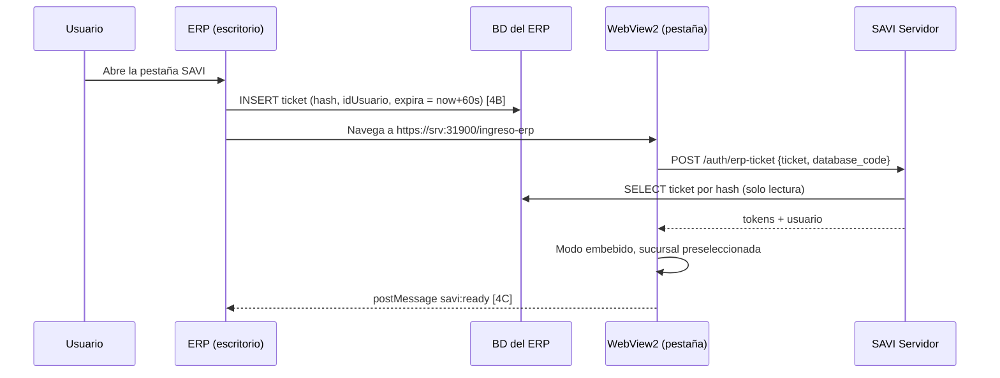

# Fase 4 — Pestaña SAVI dentro del ERP

> Parte de: [PRD — Plataforma SAVI](00-prd.md)
> Estado: **propuesta**. La Fase 4B está **bloqueada por P1** (tecnología
> del ERP) hasta confirmarla con el equipo del ERP.
> Depende de: [Fase 1](01-fase-savi-servidor.md). Se puede hacer en paralelo
> con las Fases 2 y 3.
> Alcance: frontend de SAVI (modo embebido), módulo `auth` (inicio de
> sesión único), contrato de integración para el equipo del ERP.

## Resultado esperado

- [ ] **4A — Modo embebido:** SAVI se muestra adaptado dentro de una pestaña del ERP, con login normal y sesión persistente.
- [ ] **4A — Contexto:** el ERP indica sucursal y formulario activos; SAVI preselecciona la sucursal y usa el formulario como pista.
- [ ] **4B — Inicio de sesión único** con ticket de un solo uso escrito por el ERP en su propia base.
- [ ] **4C — Puente con el ERP:** eventos `ready`, `session-expired` y `open-form`.
- [ ] Guía de integración para el equipo del ERP, con ejemplo para WebView2.
- [ ] Administración → Servidor muestra los datos que el ERP necesita (URL y huella del certificado).
- [ ] Tests de seguridad del ticket y E2E con un host de prueba.

---

## 1. Lo que sabemos y lo que no

| Dato | Estado |
|---|---|
| El ERP es una aplicación de escritorio Windows | **Probable, no confirmado.** El catálogo de conocimiento nombra formularios `frm*` (`frmEnvioFacturaElectronica`). |
| Framework (WinForms/.NET, WPF, VB6, Delphi…) | **Desconocido (P1).** Define si se puede usar WebView2. |
| Cómo se conecta el ERP a su base | Desconocido. Afecta el modelo de amenazas de 4B (§4.1). |
| Esquema de usuarios | Conocido: `Seguridad.Usuario` (`idUsuario`, `codigo`, hash MD5), el mismo que valida SAVI. |

**Preguntas para el equipo del ERP** (hay que responderlas antes de 4B):

1. ¿En qué framework y versión está el ERP? ¿Puede alojar **WebView2**
   (Evergreen Runtime)?
2. ¿El ERP se conecta a Postgres directo desde cada PC? ¿Con qué usuario
   de BD y dónde guarda esa credencial?
3. ¿Hay una tabla de parámetros globales por empresa donde guardar la URL
   de SAVI?
4. ¿Pueden agregar una tabla al esquema `Seguridad` y escribir en ella al
   abrir la pestaña?
5. ¿El ERP conoce, en tiempo de ejecución, el formulario activo y la
   empresa/sucursal (base) en la que está el usuario?

## 2. Arquitectura



Sin 4B, el ERP navega a `https://srv:31900/?embed=erp&db=CENTRO` y el
usuario inicia sesión una vez. La sesión se conserva en el perfil de
WebView2 hasta que vence el refresh token (7 días).

## 3. Fase 4A — Modo embebido y contexto

### 3.1 Parámetros de entrada

Se aceptan en la query de la URL inicial (4A) o en el fragmento de
`/ingreso-erp` (4B):

| Parámetro | Formato | Uso |
|---|---|---|
| `embed` | `erp` | Activa el modo embebido. |
| `db` | `^[A-Z0-9_-]{2,32}$` (código de base) | Preselecciona la sucursal si está en `/erp-databases/available`. Si no, se ignora en silencio. |
| `form` | `^frm[A-Za-z0-9_]{1,80}$` | Pista de pantalla (§3.3). |

- Valores fuera de formato se **descartan** antes de usarse. Nunca se
  interpolan en HTML ni en el prompt sin validar.
- El modo embebido se guarda en `sessionStorage` (`lib/storageKeys.ts`),
  para que sobreviva a la navegación interna, pero no a otra ventana.

### 3.2 Qué cambia visualmente

| Elemento | Normal | Embebido |
|---|---|---|
| Barra lateral | Visible | Colapsada por defecto, con botón para abrirla |
| Enlace a Administración | Visible para admins | **Oculto.** La administración se hace desde el navegador (evita pantallas complejas en una pestaña angosta). |
| Cerrar sesión | Menú de usuario | Oculto. La sesión la gobierna el ERP (4B) o vence sola. |
| Pantalla de bienvenida | Completa | Compacta, con la sucursal activa visible |
| Enlaces externos | Misma pestaña | `target="_blank"` → el host los abre en el navegador del sistema (4C) |
| Ancho mínimo usable | — | 360 px |

Implementación: composable `useEmbedMode()` en `src/composables/`
(`create-adaptable-composable`), que expone `isEmbedded`, `hostContext`
(`db`, `form`) y `bridge` (4C). `ChatView`, `Sidebar` y `AdminLayout`
lo consumen. **No** se duplican vistas.

### 3.3 Pista de formulario en el turno

- `POST /chat` suma un campo **opcional** `ui_context: { "form": "frmFactura" }`.
  Un frontend que no lo manda funciona igual.
- `ChatTurnUseCase.validate()` descarta `form` si no existe en el catálogo
  de conocimiento. Así, un parámetro inventado no llega al prompt.
- Si es válido, el prompt del turno agrega una línea: *"El usuario está
  en el formulario «Factura de venta» (frmFactura) del ERP."*, con el
  nombre visible tomado del catálogo.
- **No se agregan tools** (límite de 4). La tool
  `consultar_conocimiento` ya permite buscar por formulario, y la pista
  solo orienta al modelo.
- Documentar el campo en `backend/docs/FRONTEND_CHAT_SPEC.md`.

### 3.4 Sesión en la pestaña (sin 4B)

- WebView2 conserva `localStorage` en su *User Data Folder*. El ERP debe
  fijarla **por usuario de Windows** y de forma persistente (§6.2). Si no,
  el usuario inicia sesión cada vez.
- Con `401` en refresh, SAVI muestra su login dentro de la pestaña y, si
  existe el puente, emite `savi:session-expired` (4C).

## 4. Fase 4B — Inicio de sesión único

### 4.1 Opciones evaluadas

| Opción | Cómo funciona | Evaluación |
|---|---|---|
| **A. Ticket en la BD del ERP** | El ERP, con el usuario ya autenticado, inserta un ticket aleatorio de un solo uso en una tabla de su esquema. SAVI lo lee con su conexión de solo lectura y lo marca como usado en su propia BD. | **Recomendada.** No distribuye secretos nuevos. Falsificar un ticket exige escribir en la BD del ERP, que es el mismo nivel de acceso que ya da el ERP. Un atacante en la red sin credenciales de BD no puede. SAVI no necesita escribir en el ERP. |
| B. Token firmado con secreto compartido | ERP y SAVI comparten una clave HMAC; el ERP firma `{codigo, exp}`. | Hay que distribuir y rotar la clave en cada PC con ERP. Quien la extraiga firma sesiones de **cualquier** usuario, incluido un administrador, desde cualquier equipo de la red y sin tocar la BD. |
| C. Reenviar la contraseña o su hash | El ERP pasa las credenciales. | **Descartada.** El hash MD5 equivale a la contraseña, y viajaría en URLs e historial. |

**Condición para cerrar la elección de A:** la respuesta a la pregunta 2
de §1. Si el ERP guarda en cada PC una credencial de BD con permisos de
escritura, A y B quedan en el mismo nivel de exposición, y A sigue
ganando por operación (no hay secreto que rotar). Si el ERP usa un
backend intermedio sin credenciales en la PC, A es estrictamente mejor.

### 4.2 Tabla propuesta en el ERP (la crea el equipo del ERP)

Nombres con la convención del esquema actual (`"idUsuario"`,
`"razonSocial"`):

```sql
CREATE TABLE "Seguridad"."SaviTicket" (
    "idSaviTicket" BIGSERIAL PRIMARY KEY,
    "hash"         CHAR(64)    NOT NULL UNIQUE,  -- sha256 hex del ticket; el ticket en claro NUNCA se guarda
    "idUsuario"    INTEGER     NOT NULL REFERENCES "Seguridad"."Usuario"("idUsuario"),
    "creado"       TIMESTAMPTZ NOT NULL DEFAULT now(),
    "expira"       TIMESTAMPTZ NOT NULL
);
CREATE INDEX "ixSaviTicketExpira" ON "Seguridad"."SaviTicket" ("expira");
```

Responsabilidades del ERP:

1. Generar el ticket con un RNG criptográfico: 32 bytes en base64url
   (43 caracteres).
2. Insertar `hash = sha256_hex(ticket)`, el `idUsuario` de la sesión
   actual y `expira = now() + 60 s`.
3. Borrar tickets vencidos (`DELETE … WHERE "expira" < now() - interval '1 day'`)
   al insertar o con un job.
4. Navegar a `…/ingreso-erp#ticket=<ticket>&db=<código>&form=<frm>`.
   **En el fragmento (`#`), no en la query:** el fragmento no se envía al
   servidor ni queda en logs de acceso.

### 4.3 API en SAVI: `POST /auth/erp-ticket`

```json
// request
{ "ticket": "q2V…", "database_code": "CENTRO" }
// 200: mismo cuerpo que POST /auth/login
```

Flujo en `ErpTicketLoginUseCase` (`auth/application/use_cases/`):

1. `LoginThrottle.check(login_key = "ticket", ip)` (Fase 1 §6.1). Límite
   por IP, sin clave por login.
2. Validar formato del ticket (`^[A-Za-z0-9_-]{43}$`) y `database_code`.
3. Resolver la base por código (`ErpUserRepositoryFactory.for_code`).
4. `hash = sha256_hex(ticket)`. Insertar `hash` en la tabla del agente
   `erp_sso_used_tickets` (PK `hash`). Si ya existe → rechazar.
   **Se consume antes de leer** para que dos requests concurrentes con el
   mismo ticket no emitan dos sesiones.
5. Leer `SELECT "idUsuario" FROM "Seguridad"."SaviTicket" WHERE "hash" = :h AND "expira" > now()`
   en la base resuelta.
6. Cargar el usuario por `idUsuario` en esa base (método nuevo
   `UserRepository.find_by_id`) y verificar `is_active`.
7. Emitir tokens con el mismo `_issue` de `LoginUseCase`.

- Todo fallo (formato, base, ticket usado, inexistente, vencido, usuario
  inactivo) → `InvalidCredentialsError` con el mismo piso de duración de
  250 ms. Excepción: usuario inactivo → `UserDisabledError`, con la misma
  justificación que en `login.py:123`.
- `now()` es el reloj **de la BD del ERP**, el mismo que usó el ERP para
  `expira`. Así se evita el desfase entre servidores.
- Tabla del agente `erp_sso_used_tickets`: `hash CHAR(64) PK`,
  `erp_database_id`, `used_at`. Purga de filas de más de 1 día al
  arrancar y cada 24 h.
- La pantalla de entrada del frontend es **`/ingreso-erp`** y no
  `/auth/…`: `"auth"` está en `_API_PREFIXES` (`main.py:56`), así que
  cualquier ruta bajo `/auth` se trata como API y nunca llega a la SPA.

### 4.4 Configuración y detección

| Variable | Default | Uso |
|---|---|---|
| `ERP_SSO_ENABLED` | `false` | Sin esto, `/auth/erp-ticket` responde `404`. |
| `ERP_SSO_TICKET_TABLE` | `"Seguridad"."SaviTicket"` | Por si el equipo del ERP elige otro nombre. Validado contra una expresión estricta y **no** interpolado desde datos de usuario. |

`GET /admin/server-status` (Fase 1 §8) suma
`erp_sso: {enabled, tables: {"CENTRO": true, "NORTE": false}}`,
verificando la existencia de la tabla por base con
`to_regclass(...)`. `PostgresConnectionTester` **no** exige la tabla: el
SSO es opcional por base.

### 4.5 Frontend: `/ingreso-erp`

`modules/auth/views/ErpLaunchView.vue`:

1. Lee y **borra de inmediato** el fragmento (`history.replaceState`),
   antes de cualquier `await`.
2. Valida parámetros (§3.1).
3. `POST /auth/erp-ticket`. Con éxito: guarda la sesión como el login
   normal, activa el modo embebido, preselecciona `db` y navega a `/`.
4. Con error: pantalla corta "No se pudo iniciar sesión automáticamente"
   con botón "Iniciar sesión" (login normal embebido) y, si hay puente,
   `savi:sso-failed`.

## 5. Fase 4C — Puente con el ERP

Solo si el host es WebView2. Detección:
`window.chrome?.webview?.postMessage`. Si no existe, todo es no-op.

### 5.1 SAVI → ERP

| Mensaje | Payload | Cuándo |
|---|---|---|
| `savi:ready` | `{version}` | Chat listo. |
| `savi:session-expired` | `{}` | Refresh falló. El ERP genera un ticket nuevo y recarga `/ingreso-erp`. |
| `savi:sso-failed` | `{reason: "invalid"}` | Ticket rechazado. |
| `savi:open-form` | `{form}` | El usuario hace clic en "Abrir en el ERP" en una respuesta que menciona un formulario del catálogo. |
| `savi:open-external` | `{url}` | Enlace externo; el ERP lo abre en el navegador del sistema. Solo `https:`. |

### 5.2 ERP → SAVI

| Mensaje | Payload | Efecto |
|---|---|---|
| `erp:context` | `{db?, form?}` | El usuario cambió de formulario o de empresa. SAVI actualiza la pista y la preselección para la **próxima** conversación. Nunca cambia la base de una conversación existente (D2 de multi-BD). |

- Formato: `{ "type": "savi:ready", "payload": {…} }`. Todo mensaje
  entrante se valida con Zod (`zod-4`). Los desconocidos se ignoran.
- **`open-form`** solo se ofrece en modo embebido y para formularios que
  existen en el catálogo. **Hoy el chat no muestra chips de formulario**
  (verificado: no hay referencias a formularios en
  `frontend/src/modules/chat`). La fuente confiable son las
  `tool_invocations` de `consultar_conocimiento`, no el texto libre del
  modelo:
  - el backend agrega al evento `tool_result` una lista `forms` (códigos
    del catálogo devueltos por la tool), sin exponer nombres internos de
    tools al usuario;
  - el frontend muestra debajo de la respuesta un chip "Abrir «Factura de
    venta» en el ERP" por formulario;
  - el contrato del evento se documenta en `FRONTEND_CHAT_SPEC.md`.

## 6. Contrato para el equipo del ERP

Se entrega como `docs/plataforma/guia-integracion-erp.md`, escrita **al
cerrar 4A**, con lo que ya esté implementado.

### 6.1 Configuración única por empresa

Se guarda en los **parámetros globales del ERP**, no en cada PC:

| Parámetro | Ejemplo | Origen |
|---|---|---|
| `SAVI_URL` | `https://SRV-FARMX:31900` | Administración → Servidor → "Configuración para el ERP" |
| `SAVI_CERT_SHA256` | `9F:3A:…` | Misma pantalla (solo si el certificado es autofirmado) |
| `SAVI_SSO` | `true` / `false` | Si se creó la tabla de §4.2 |

`ServerStatusView` (Fase 1) suma la tarjeta **"Configuración para el
ERP"** con esos tres valores y botones para copiar.

### 6.2 Requisitos del control WebView2

- *User Data Folder* persistente por usuario de Windows:
  `%LOCALAPPDATA%\SEO\SAVI-WebView`.
- **Certificado autofirmado sin GPO:** manejar
  `CoreWebView2.ServerCertificateErrorDetected` y permitir **solo** si la
  huella SHA-256 del certificado coincide con `SAVI_CERT_SHA256`
  (pinning). Cualquier otra huella se rechaza.
- `NewWindowRequested` → abrir en el navegador del sistema y cancelar.
- `WebMessageReceived` → despachar según §5.1.
- Deshabilitar `AreDevToolsEnabled` en producción.

### 6.3 Ejemplo de referencia (C#, WinForms + WebView2)

Solo aplica si P1 confirma .NET. Es orientativo, no código productivo:

```csharp
async Task AbrirSaviAsync(int idUsuario, string codigoBase, string formularioActivo)
{
    var ticket = Base64UrlEncode(RandomNumberGenerator.GetBytes(32));
    var hash = Convert.ToHexString(SHA256.HashData(Encoding.ASCII.GetBytes(ticket))).ToLowerInvariant();

    await using (var cmd = conexionErp.CreateCommand())
    {
        cmd.CommandText = @"INSERT INTO ""Seguridad"".""SaviTicket"" (""hash"", ""idUsuario"", ""expira"")
                            VALUES (@h, @u, now() + interval '60 seconds')";
        cmd.Parameters.AddWithValue("h", hash);
        cmd.Parameters.AddWithValue("u", idUsuario);
        await cmd.ExecuteNonQueryAsync();
    }

    var url = $"{parametros.SaviUrl}/ingreso-erp#ticket={ticket}" +
              $"&db={Uri.EscapeDataString(codigoBase)}&form={Uri.EscapeDataString(formularioActivo)}";
    webView.CoreWebView2.Navigate(url);
}
```

### 6.4 Alternativa sin WebView2

Si P1 descarta WebView2, un botón **"Abrir SAVI"** del ERP ejecuta el
mismo flujo de ticket y abre `…/ingreso-erp#…` en el navegador
predeterminado (`Process.Start` o el equivalente del framework). Se
pierden el puente (4C) y la vista integrada, pero se mantiene el inicio
de sesión único.

## 7. Seguridad

| Riesgo | Mitigación |
|---|---|
| Reuso de ticket | Consumo atómico por PK antes de leer (§4.3 paso 4). |
| Ticket en logs o historial | Viaja en el fragmento; se borra con `replaceState` antes de cualquier `await`; SAVI nunca lo loguea (test). |
| Fuerza bruta de tickets | 256 bits de entropía + límite por IP + vida de 60 s. |
| Parámetros manipulados (`db`, `form`) | Validación estricta; `db` solo preselecciona entre bases con acceso (D3); `form` validado contra el catálogo. |
| Pestaña con certificado equivocado | Pinning por huella en WebView2 (§6.2). |
| Mensajes falsos del host | El host **es** el ERP del usuario; aun así, validación Zod y acciones de solo lectura o de navegación. |
| `open-external` a esquemas peligrosos | Solo `https:`. |

## 8. Tests

### 8.1 Backend

| Test | Verifica |
|---|---|
| Ticket válido | Emite sesión para el `idUsuario` correcto en la base indicada. |
| Un solo uso | Segundo uso → `InvalidCredentialsError`. Dos requests concurrentes → una sola sesión. |
| Vencido | Rechazado, con `now()` de la BD del ERP (fixture que fija el tiempo). |
| Base equivocada | Ticket de la base A presentado con `database_code` B → rechazado. |
| Usuario inactivo | `UserDisabledError`. |
| Indistinguibles | Formato inválido, inexistente, usado y vencido → mismo body, status y piso de duración. |
| Deshabilitado | `ERP_SSO_ENABLED=false` → `404`. |
| Sin logs | El ticket no aparece en ningún registro capturado durante el flujo. |
| `ui_context.form` | Inexistente en el catálogo → no llega al prompt; existente → línea exacta en el prompt. |
| Detección | `server-status.erp_sso.tables` refleja `to_regclass` por base. |

### 8.2 Frontend

- Vitest: `useEmbedMode` (parseo y validación de parámetros,
  persistencia en `sessionStorage`); `ErpLaunchView` borra el fragmento
  antes de llamar al servicio; puente no-op sin WebView2; validación Zod
  de mensajes entrantes.
- Playwright con **host simulado**: página de prueba que abre SAVI en un
  iframe con `?embed=erp&db=…`. El backend de prueba debe permitir ese
  origen en `frame-ancestors`, porque la CSP de la Fase 1 (§6.3) lo
  bloquea por defecto. Verifica layout embebido y preselección.
  Además, un flujo con un ticket insertado en una tabla de prueba sobre
  `farmacias_similares` (en una BD de prueba con permiso de escritura,
  **no** la conexión de solo lectura de SAVI).

### 8.3 Verificación con el equipo del ERP

Prueba conjunta en la VM de la Fase 1: el ERP real abre la pestaña,
entra sin credenciales, preselecciona la sucursal, `open-form` abre el
formulario y un certificado con otra huella es rechazado.
